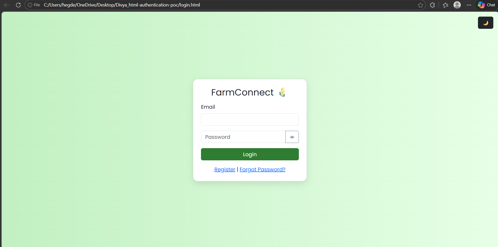
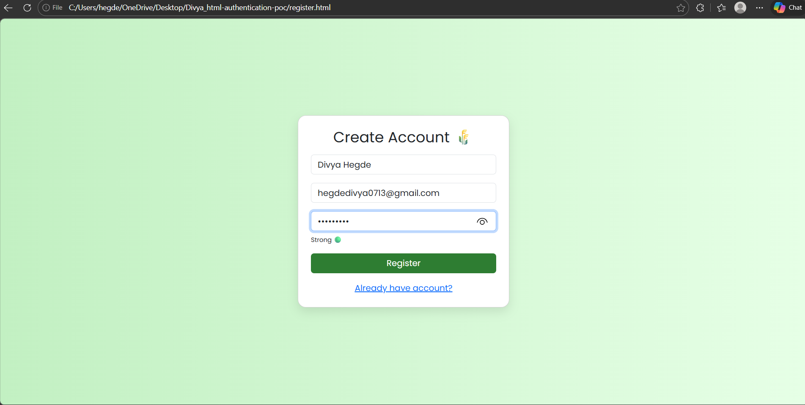
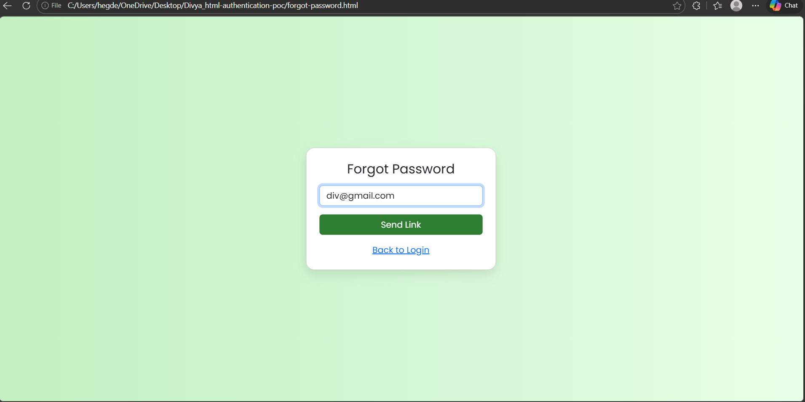
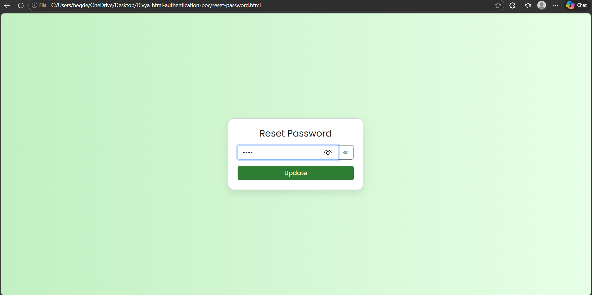
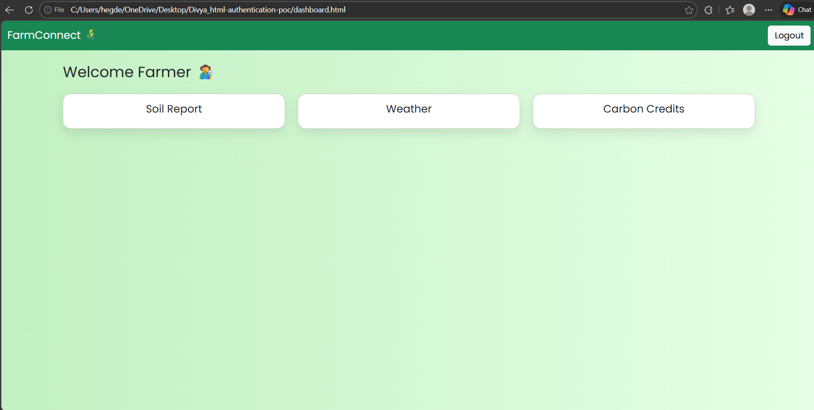

# 🌾 FarmConnect Authentication System

A responsive authentication system built using **HTML, Bootstrap 5, and custom CSS**.

---

## 🚀 Features

* Login Page
* Registration Page
* Forgot Password Page
* Reset Password Page
* Dashboard

### ⭐ Bonus Features

* Dark Mode Toggle 🌙
* Show/Hide Password 👁
* Password Strength Indicator 🔒
* Loading Button ⏳
* Smooth Animations 🎨

---

## 🛠️ Technologies Used

* HTML5
* Bootstrap 5
* CSS3
* JavaScript

---

## 📁 Project Structure

* index.html
* register.html
* forgot-password.html
* reset-password.html
* dashboard.html
* styles.css
* README.md

---

## 📸 Screenshots

### 🔐 Login Page

### 📝 Registration Page

### 🔑 Forgot Password

### 🔄 Reset Password

### 📊 Dashboard

---

## ⚙️ How to Run

1. Download or clone repository
2. Open folder
3. Open `index.html` in browser

---

## 📌 Note

This is a frontend-only project.
No backend or database is used.

---

## 👨‍💻 Author

Divya Devaraj Hegde
Fullstack Java Development

---

## ⭐ Conclusion

This project demonstrates a responsive and user-friendly authentication system using Bootstrap and custom styling.
